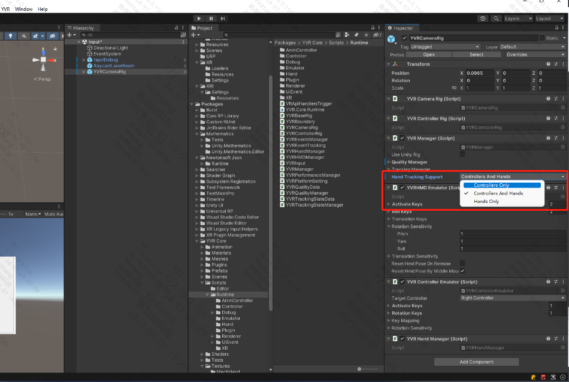

# 手势追踪

## 配置开发环境

### 设备

- YVR1
- YVR2

### 设备系统版本

- 1.2.2.209 及以上

### Unity 版本

- 2020.3 LTS 及以上 

## 配置流程

1. 在设备的系统实验室下打开**手部追踪**功能。

2. 导入 YVR 软件包。

3. 在 Unity 编辑器中创建一个场景或打开已有的场景。
4. 将 `com.yvr.core/Prefabs/` 目录下的 `YVRCameraRig` 拖拽至 `Hierarchy` 面板中。
5. 选中 `YVRCameraRig`， 在 `YVRManager` 组件中从`Hand Tracking Support`里选择是否支持手势追踪或手柄，为应用启动手势追踪或手柄能力。

6. 构建该场景，然后在设备上运行。
> [!Note] 
> 具体接口请查看代码注释。

## 获取手势追踪数据

你可以通过调用 SDK 提供的接口来获取手势追踪相关信息，包括功能启用状态、追踪精确度、手势数据、手部交互状态。

### 功能启用状态

| **接口** | **功能启用状态** |
| :------- | :-------------  | 
| YVRHandManager.GetHandTrackingEnable | 来获取手势追踪功能的启用状态。请求将返回一个布尔值，`true` 表示“启用”，`false` 表示“未启用”。 |
| YVRHandManager.SetCurrentInputDevice | 强制设置当前应用使用手柄或手势追踪。|

### 追踪精确度 & 手势数据

| **接口** | **手势数据** |
| :------- | :-------------  | 
| YVRHandManager.leftHandData / YVRHandManager.rightHandData | 获取手势数据，包括关节数量、手部尺寸、关节方向和位置，以及手部交互状态，包括射线交互的姿态，以及各个手指是否捏合和具体的捏合力度。 |

### 手部交互状态

| **接口** | **手部交互状态** |
| :------- | :-------------  | 
| YVRHandManger.GetFingerPinchStrength | 获取其他手指与大拇指的捏合强度。 |
| YVRHandManager.GetPinch | 获取手指是否正在捏合。 |
| YVRHandManager.GetPinchDown | 获取当前帧手指是否触发捏合。 |
| YVRHandManager.GetPinchUp | 获取当前帧手指是否触发取消捏合。 |

### 手柄输入与手势输入切换

在设备开启了手势追踪能力后，
- 手柄切换手势输入的条件为：手柄未连接或已连接的手柄静置 5 秒，开启手势追踪
- 手势输入切换手柄的条件为：手柄开机或已连接的休眠手柄有按键触发

**切换设备输入流程**
1. 监听 YVRManager.instance.eventManager.onInputDeviceChange 事件
2. 事件响应时调用 YVRPlugin.Instance.GetCurrentInputDevice(ref ActiveInputDevice inputDevice) 查询当前输入设备
3. 设置当前输入设备为 UI 交互输入，YVRInputModule.Instance.SetInputDataProvider(DataProviderSource source)
4. 显示与隐藏对应的设备对象

> [!Note]
> 交互工具包推荐采用 [Samples | XR Interaction Toolkit | 2.3.1](https://docs.unity3d.com/Packages/com.unity.xr.interaction.toolkit@2.3/manual/samples.html#hands-interaction-demo)