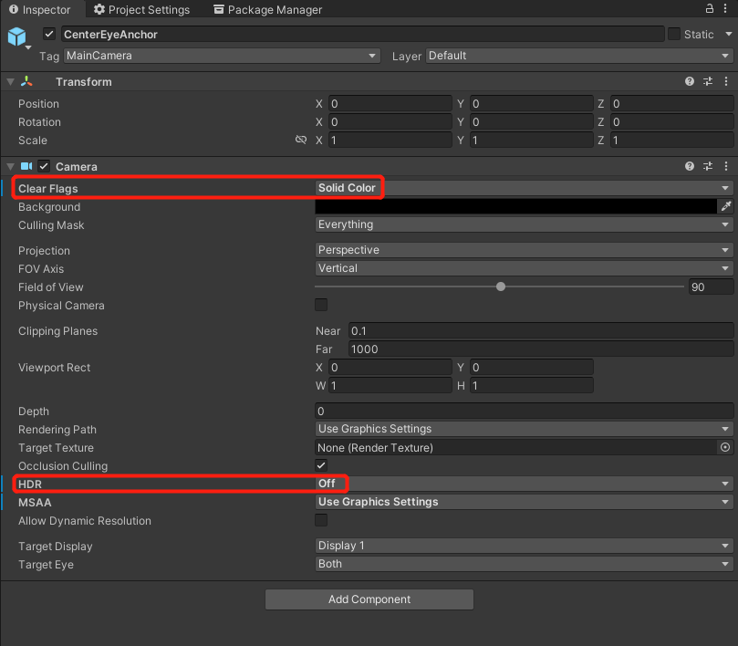
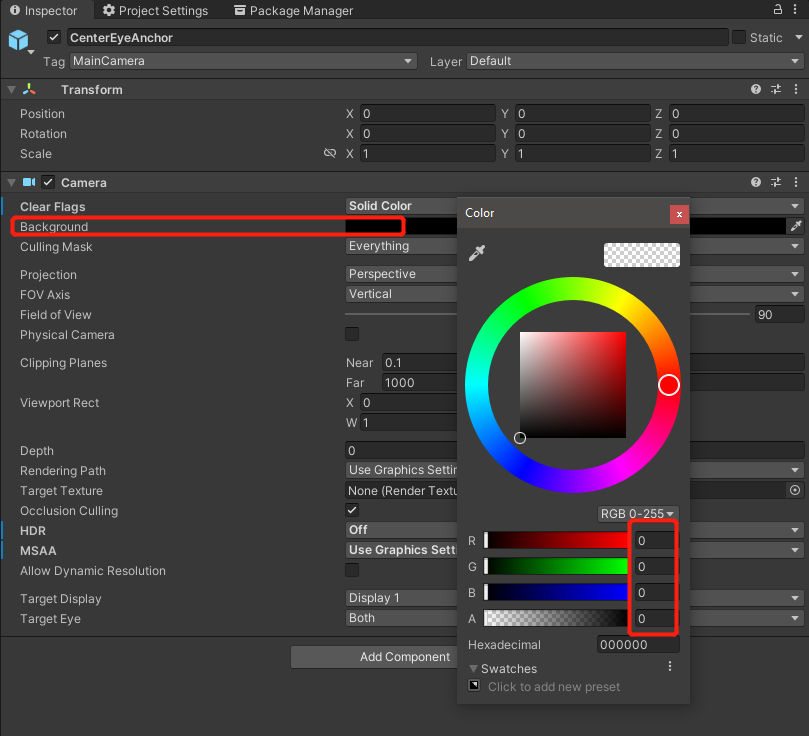

# 透视

透视这项功能允许用户走出 VR 世界看到现实生活中的东西。它使用 HMD 摄像头和图像处理算法来捕捉和接近用户在直接透过 HMD 显示屏时看到的东西。这最终实现了现实世界和虚拟场景的融合，创造出一个混合现实的场景。

## Requirement

- SDK 版本: 2.3.0 

## 配置设置

1. 完成入门指南。如果已完成，请跳过此步骤。 

2. 在主摄像机中，选择 `CenterEyeAnchor`。

3. 选择 `Inspector -> Camera`。

4. 设置 `Clear Flags` 为 **Solid Color**，`HDR` 为 **Off**。

5. 设置 `Background` 为 **RGBA (0000) / Hexadecimal 000000**。

6. 在项目中设置透视开关 `YVRSetPassthroughVisible(enable)`。 