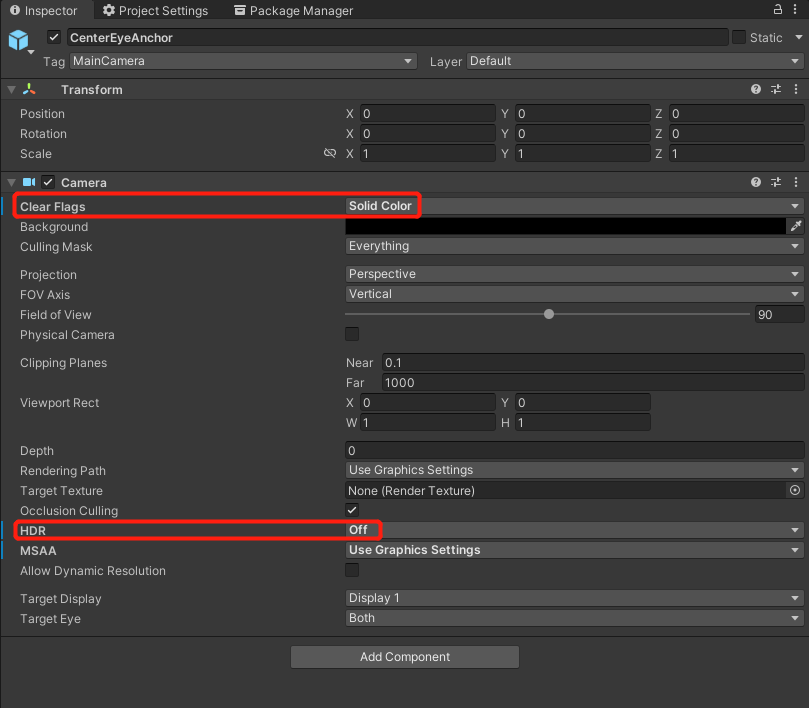
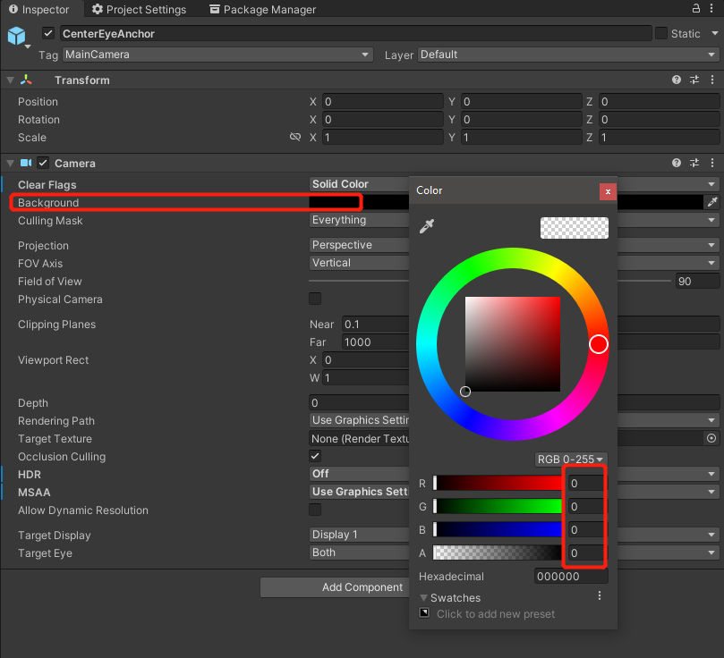

# Passthrough

Passthrough is a feature allowing users to step outside of the VR world and see what's around in real life. It uses HMD cameras and image processing algorithms to capture and approximate what users would see if they could directly look through the display of the HMD. This finally enables the blend of the real-world and the virtual scenes to create a mixed-reality scene.

## Requirement

- SDK Version: 2.3.0 

## Configure Settings

1. Complete Get Started guide, skip this if you have completed. 

2. In the main camera, select `CenterEyeAnchor`.

3. Go to `Inspector -> Camera`. 

4. Set `Clear Flags` to **Solid Color** and `HDR` to **Off**.

5. Set `Background` to **RGBA (0000) / Hexadecimal 000000**.

6. `YVRSetPassthroughVisible(enable)` enable passthrough in your project. 