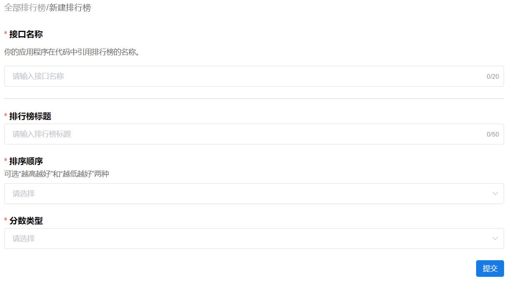
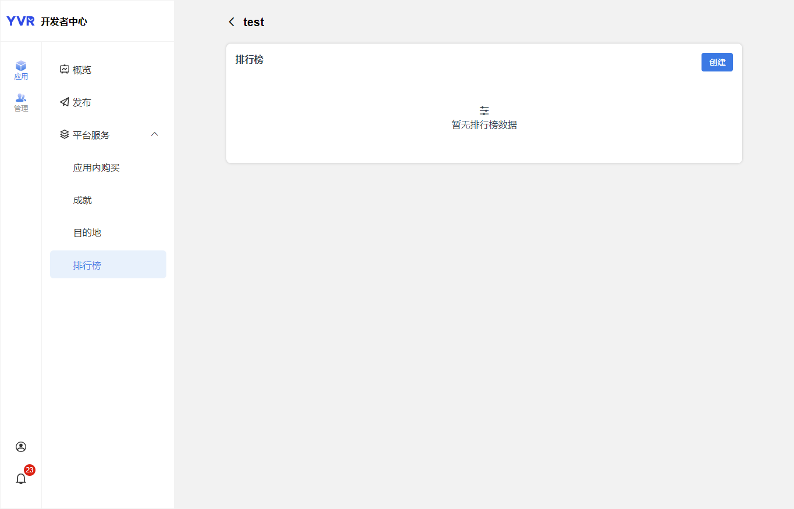

# 排行榜

在游戏中设立排行榜功能，可以推动玩家之间的竞争，从而提升用户的活跃度和参与感。YVR的排行榜提供功能包括：

- 自动计算排名
- 检索排行榜数据
- 更新排行榜数据

## 创建排行榜

在YVR开发者中心可创建排行榜，步骤如下：

1. 登录[管理中心 | YVR开发者平台 (yvrdream.com)](https://developer.yvrdream.com/yvrdev/all_apps)

2. 打开需要设置排行榜的应用，进入应用页。

3. 点击左侧导航栏的平台服务-排行榜。

4. 点击 “创建” ，并进入以下页面：

5. 打开新建排行榜页面，参数说明如下：

   | **参数**       | **说明**       |
   | :------------: | :------------- | 
   | 接口名称 | 它是一个独特的字符串，允许应用程序在代码中引用排行榜的名称。接口名称区分大小写，在提交后不可修改。可包含字母数字和下划线 "_" 字符，不能包含空格或其他特殊字符，最多20个字符。一个应用可创建多个排行榜，同一个应用的排行榜不能同名接口。 |
   | 排行榜名称 | 排行榜标题，可支持中英文、符号、空格和最多50个字符。 |
   | 排序顺序 | 根据使用情况，有两个排序选项：“越高越好” 或 “越低越好”。 |
   | 分数类型 | 选择一个分数类型在排行榜上显示，如：距离（英尺）、距离（米）、百分比（%）、分数、时间（毫秒）、时间（秒）。 |

6. 等待 YVR 通过排行榜信息的审核。审核中的排行榜可在开发阶段调用，应用上架前需要完成排行榜审核。

## 查看排行榜数据

后台可查看当前排行榜的数据，包括排名、用户、分数和最后一次更新时间。“清空条目”功能会将该排行榜下所有条目清除，该操作不可逆，请谨慎操作。

## 排行榜条目

排行榜数据包括排行榜的基础信息（例如总条目数）和条目数据。“条目数据” 指的是记录用户在应用程序中特定数据的条目，包括:

| **参数**              | **说明**             |
| :------------         | ----------------    |
| addTime               | 数据添加时间。|
| extraData             | 附加信息，不超过 2KB。|
| extraDataLength       | 功能未开放。|
| icon                  | 用户头像。|
| id                    | 用户ID。|
| leaderboardApiId      | 排行榜接口名称。|
| name                  | 用户昵称。|
| score                 | 分数。|
| sort                  | 排名。|
| updatePolicy          | 功能未开放。|
| updateTime            | 数据更新时间。|

排行榜根据开发者设置由小到大或由大到小排序，分数相同的用户排名值不相同，例如：

| **排名** | **分数**   |
| :------: | :-------: |
| 1        | 9         |
| 2        | 6         |
| 3        | 6         |
| 4        | 1         |

### 按等级检索排行榜

该方法按等级检索指定排行榜的条目列表。

`GetLeaderboardInfoByPage(LeaderboardByPage)`

| **参数**              | **说明**          |
| :------------         | :--------------- |
| currentStart          | 用于定义从何处开始返回条目。若希望获取第一个条目，则传入1。传入0，则代表从当前用户开始。若排行榜中不包含当前用户，则不返回条目。 |
| dataDirection         | 获取条目的方向，包含以下枚举： <ul><li>forward：向前取条目，排名值减小，如果条目不足，不需要补全。</li> <li>backward：向后取条目，排名值增加，如果条目不足，不需要补全。</li> <li>none：将currentStart的条目置于中间。</li></ul> |
| leaderboardApiId      | 排行榜接口名称。|
| pageType              | 用于定义筛选条件，限定返回结果的范围，包含以下枚举：<ul><li>none：不进行筛选，返回所有条目。</li> <li>friends：当前用户及其好友的条目，Sort值会按照好友的排行重新给出。</li></ul>|
| size                  | 返回的条目数量。|

当 "dataDirection" 参数取值为 "none" 时，"currentStart" 和 "size" 参数的取值奇偶性会影响返回结果中的条目。具体情况如下：

| **size 参数取值的奇偶性**            | **返回情况**          |
| :-------------------------         | :-------------------|
| 奇                 | <ul><li>往前和往后各查询到 [(Size-1)/2] 个条目。例如，总条目数为10，Size=5，currentStart为第5名，则返回条目3、4、5、6、7。</li> <li>往前查询到的条目数小于 [(Size-1)/2] 个，则向后补齐缺少的条目。例如，总条目数为10，Size=5，currentStart为第2名，则返回条目1、2、3、4、5。</li> <li>往后查询到的条目数小于 [(Size-1)/2] 个，则忽略缺少的条目。例如，总条目数为10，Size=5，currentStart为第9名，则返回条目7、8、9、10。</li></ul>
| 偶                | <ul><li>往前可查询到 [(Size/2)-1] 个条目，往后可查询到 (Size/2) 个条目，例如，总条目数为10，Size=6，currentStart为第5名，则返回条目3、4、5、6、7、8。</li> <li>往前查询到的条目数小于 [(Size/2)-1] 个，则向后补齐缺少的条目。例如，总条目数为10，Size=6，currentStart为第2名，则返回条目1、2、3、4、5、6。</li> <li>往后查询到的条目数小于 [(Size-1)/2] 个，则忽略缺少的条目。例如，总条目数为10，Size=6，currentStart为第9名，则返回条目7、8、9、10。</li><ul> |

### 按页检索排行榜

该方法按页面检索指定排行榜的条目列表。 

`GetLeaderboardInfoByPage(LeaderboardByPage)`

| **参数**              | **说明**          |
| :-------------        | :--------------- |
| current               | 当前页码，若希望获取第一页条目，则传入 1。|
| leaderboardApiId      | 排行榜名称。|
| pageType              | 用于定义筛选条件，限定返回结果的范围，包含以下枚举：<ul><li>none：不进行筛选，返回所有条目。</li> <li>friends：当前用户及其好友的条目，Sort值会按照好友的排行重新给出。</li><ul>|
| size                  | 用于定义每页展示的条目数量。|

### 更新排行榜数据

`LeaderboardWriteItem(LeaderboardEntry)`

每位用户在排行榜中仅具有单一条目。当用户在应用程序中获得新的得分/成绩时，可更新其在排行榜中的排名。默认情况下，仅保留用户的最佳成绩，即仅当成绩提高（根据开发者设置越大越好或越小越好）时才更新条目，否则放弃更新；也可设置强制更新。写入条目时，可添加自定义内容，例如游戏的回放视频图片等。

| **参数**              | **说明**           |
| :------------         | :--------------- |
| extraData             | 与排行榜条目关联的 2KB 自定义数据字段。这可以是游戏回放或任何向观众提供有关条目的更多详细信息的内容。|
| extraDataLength       | 功能未开放。 |
| forceUpdate           | D定义是否强制更新分数。如果设置为 true，则分数始终更新，即使它不是用户的最佳分数。|
| leaderboardApiId      | 排行榜名称。|
| score                 | 要写入的分数。 |

虽然可在开发者平台选择以下分数的数据类型，但目前在排行榜数据中都以float类型存储，不会自动转换格式。
- 距离（英尺）1,000 ft
- 距离（米）1,000 m
- 百分比 1000%
- 分数1,000
- 时间（精确到毫秒）00:00:01
- 时间（精确到秒） 00:16:40s

> [!NOTE]
> 更多信息，请参考 [Leaderboard API Documentation](xref:YVR.Platform.Leaderboard)。