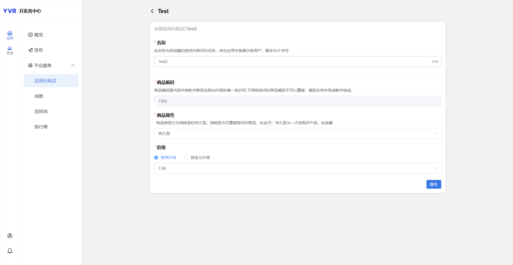
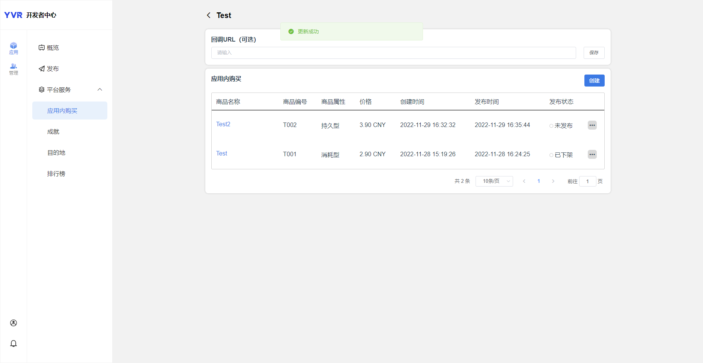

# 应用内购

YVR 支付是一个基于 YVR 账户系统的当前支付系统。支付结算由 YVR 的游戏货币（Y币）完成。用户需要进入 YVR 用户中心为其账户充值。

## 添加商品

1. 登入[开发者中心](https://developer.yvrdream.com/yvrdev/all_apps)。

2. 点击已创建应用，选择 **应用 > 平台服务 > 应用内购买**，点击创建。

3. 填入商品信息：

    - **名称**：向用户显示的商品名称。

    - **商品编码**：每个商品的独特编码。 

    - **商品属性**：消耗型或持久型。

    - **价格**：推荐或自定义。

    

4. 点击提交。

- 发布状态：未发布 / 已发布 / 已下架

## 接口信息

### 内购商品：
`YVR.Platform.IAPProduct` 提供商品信息，包含以下属性：

| **IAPProduct** | **类型** | **定义** |
|:-------------- | :------- | :------ |
| appID | long | 应用ID |
| uniqueID | string | 商品唯一识别号 |
| name | string | 商品名称 |
| description | string | 商品信息 |
| icon | string | 商品图标 |
| type | int | 商品类型：消耗品或非消耗品 |
| price | float | 商品价格 |

### 订单商品
`YVR.Platform.IAPPurchasedProduct` 提供已购买的商品信息。
`YVR.Platform.IAPPurchasedProductList` 提供所有购买的商品数据。

一个已购买的商品包含以下属性： 

| **IAPPurchasedProduct** | **类型** | **定义** |
|:----------------------- | :------- | :------ |
| orderID | string | 订单号 |
| uniqueID | string | 商品唯一识别号 |
| name | string | 商品名称 |
| icon | string | 商品图标 |
| type | int | 商品类型：消耗品或非消耗品 |

