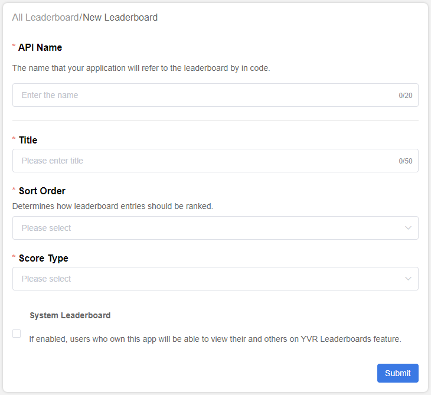
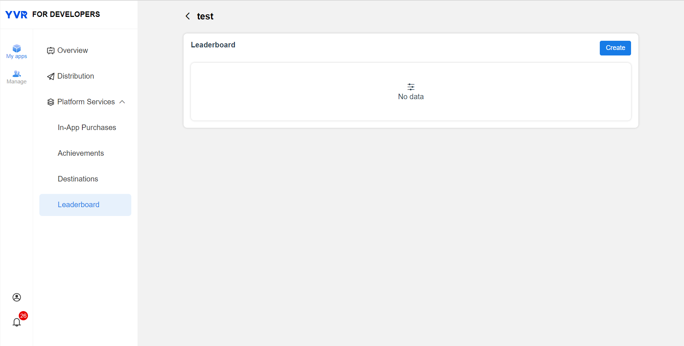

# Leaderboard

Leaderboard is a way to keep track of players and their scores in relation to other in a game. This creates competition among users and promotes user interactions. As such, it increases user activeness and engagement among them. YVR's leaderboard offers the following features：

- Auto Ranking Calculation
- Retrieve Leaderboard Data
- Update Leaderboard Data

## Create a Leaderboard

To create a leaderboard in YVR Developer Center, please refer to the following steps:

1. Log in to [Management Center | YVR Developer Platform (yvrdream.com)](https://developer.yvrdream.com/yvrdev/all_apps).

2. Select the app that is set to use the leaderboard. Enter the app page. 

3. Click Platform Service - Leaderboard on the left navigation panel.

4. Click Create. This leads you to the following interface:

    

5. Open the page of the created Leaderboard. Parameter descriptions are the following:

    | **Parameter**          | **Description**|
    | :------------          | :------------- | 
    | API Name               | An unique string that you will allow you to reference this leaderboard in your app code. The API Name is case-sensitive, allows numbers and "_", does not allow special characters and spaces, with maximum 20 characters. This cannot be modified after submission. The name you define in the Dashboard must exactly match the name you reference in your code. An app can create multiple leaderboards, but not same API name in the same app. |
    | Title                  | Enter a Title for your leaderboard that will display publicly. It can be in English or Chinese, symbols, spaces and maximum 50 characters. |
    | Sort Order             |  There are two options for Sort Order depending on your use-case, "Higher is Better" or "Lower is Better". |
    | Score Type             | Select a Score Type to determine how scores are displayed on Leaderboard, e.g. Distance (ft), Distance (m), Percentage (%), Point, Time (ms), and Time (s). |

6. After submission, wait for YVR leaderboard information's review approval. Leaderboard that is under reviewing can be used during development phase. Leaderboard's review must be completed before application is released on store. 

## View the Leaderboard Data 

Current data can be retrieved and viewed, data includes users score and last updated time. There is a clear function that will remove all the entries in the leaderboard. This action is irreversible, please operate this with caution. 

## Leaderboard Entry

Leaderboard data includes basic information about the leaderboard (such as the total number of entries) and entry data. "Entry data" refers to entries that record specific data about the user in the app, including the following: 

| **Parameter**         | **Description**  |
| :------------         | ---------------- |
| addTime               | Data added time. |
| extraData             | Additional information, does not exceed 2KB. |
| extraDataLength       | N.A. |
| icon                  | User profile picture. |
| id                    | User ID. |
| leaderboardApiId      | Leaderboard API name. |
| name                  | User display name. |
| score                 | Score. |
| sort                  | Leaderboard sorting order. |
| updatePolicy          | N.A. |
| updateTime            | Data updated time. |

The ranking is sorted ascedingly (from smallest to largest) or descendingly (largest to smallest) according to the developer's settings. Users with the same score are given with the same ranking, for example:

| **Rank** | **Score** |
| :------: | :-------: |
| 1        | 9         |
| 2        | 6         |
| 3        | 6         |
| 4        | 1         |

### Retrieve Leaderboard by Rank

This method retrieves a list of entries for a specified leaderboard by rank. 

`GetLeaderboardInfoByPage(LeaderboardByPage)`

| **Parameter**         | **Description**  |
| :------------         | :--------------- |
| currentStart          | Use to define where to start returning entries. If retrieving the first entry, input 1. Inputing 0 means starting from the current user, if the list does not contain the current user, no entry will be returned. |
| dataDirection         | Retrieving data in its order. <ul><li>forward: The ranking value decreases, if there are not enough entries, no need to complete.</li> <li>backward: The ranking value increases, if there are not enough entries, no need to complete.</li> <li>none: Have the currentStart entry in the middle.</li></ul> |
| leaderboardApiId      | Leaderboard API name. |
| pageType              | Use to define filtering conditions that limit the range of results returned. <ul><li>none: No filtering, returns all entries.</li> <li>friends: The entries of the current user and his friends, the Sort value will rearrange the ranking among them.</li></ul> |
| size                  | Number of entries returning. |

When the "dataDirection" parameter is "none", the parity of the "currentStart" and "Size" parameters will affect the entries in the returned results. The details are as follows:

| **Parity of size values**          | **Return Scenario** |
| :-------------------------         | :-------------------|
| Odd value                 | <ul><li>Goes backwards and forwards to [(Size - 1)/2] entries. For example, if the total number of entries is 10, size=5, and currentStart is the in 5th place, the entries 3, 4, 5, 6, and 7 are returned.</li> <li>If the number of entries is less than [(Size-1)/2], the missing entries are added backwards. For example, if the total number of entries is 10, size=5, and currentStart is in the 2nd place, the entries 1, 2, 3, 4, and 5 are returned.</li> <li>If the number of backward entries is less than [(Size - 1)/2], the missing entries are ignored. For example, if the total number of entries is 10, Size=5, and currentStart is in the 9th place, the entries 7, 8, 9, and 10 are returned.</li></ul>
| Even value                | <ul><li>If the total number of entries is 10, size=6, and currentStart is in the 5th place, then the entries 3, 4, 5, 6, 7, and 8 are returned.</li> <li>If the number of entries is less than [(Size/2)-1], the missing entries are added backward. For example, if the total number of entries is 10, size=6, and currentStart is in the 2nd place, the entries 1, 2, 3, 4, 5, and 6 are returned.</li> <li>If the number of entries is less than [(Size-1)/2], the missing entries are ignored. For example, if the total number of entries is 10, size=6, and currentStart is in the 9th place, the entries 7, 8, 9, and 10 are returned.</li><ul> |

### Retrieve Leaderboard by Page

This method etrieves a list of entries for a specified leaderboard by page. 

`GetLeaderboardInfoByPage(LeaderboardByPage)`

| **Parameter**         | **Description**  |
| :-------------        | :--------------- |
| current               | The current page number, input 1 if retrieving the first page entry. |
| leaderboardApiId      | Leaderboard API name. |
| pageType              | Use to define filtering conditions that limit the range of results returned. <ul><li>none: No filtering, returns all entries.</li> <li>friends: The entries of the current user and his friends, the Sort value will rearrange the ranking among them.</li><ul> |
| size                  | Number of entries returning. |

### Update Leaderboard Data

`LeaderboardWriteItem(LeaderboardEntry)` 

Every user only has one entry in the leaderboard. The user's ranking in the leaderboard can be updated when he/she obtains a new score in the app (game). By default, only the user's best score is kept, i.e. the entry is updated only when the score improves (bigger is better or smaller is better, depending on the developer's settings). Otherwise, the update is discarded; mandatory updates can also be set. When writing entries, custom contents can be added, such as replay video images of games.

| **Parameter**         | **Description**  |
| :------------         | :--------------- |
| extraData             | Additional information, does not exceed 2KB. |
| extraDataLength       | N.A. |
| forceUpdate           | Defines if the score is forced to be updated. If set to true, the score is always updated, even if it is not the user's best score. |
| leaderboardApiId      | Leaderboard API name. |
| score                 | Game score. |

Although the data types of the following scores can be selected in the developer's platform, they are currently stored as float types in the leaderboard data and do not automatically convert the format.
- Distance (ft) 1,000 ft
- Distance (meters) 1,000 m
- Percentage 1000%
- Score 1,000
- Time (to milliseconds) 00:00:01
- Time (to the second) 00:16:40s

> [!NOTE]
> For more information, please refer to [Leaderboard API Documentation](xref:YVR.Platform.Leaderboard).