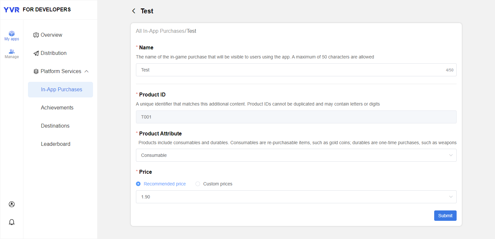
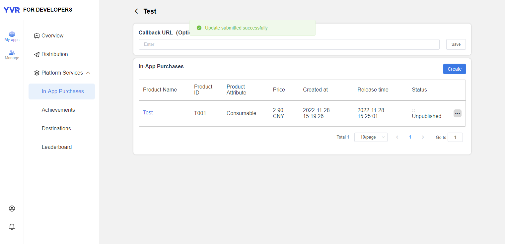

# In-App Purchase

YVR Payment is a current payment system based on YVR account system. The payment settlement is done by YVR's game currency (Y coin). Users will need to enter YVR user centre to top-up their account.

## Add Product

1. Login to [Management Center](https://developer.yvrdream.com/yvrdev/all_apps). 

2. Click on the app that you have created, select **My apps > Platform Services > In-App Purchases**. Click Create to add new product. 

3. Fill the product information: 

    - **Name**: Product name that is displayed to the users.

    - **Product ID**: Unique ID of each product. 

    - **Product Attribute**: Consumable or durable.

    - **Price**: Recommended or custom. 

    

4. Click Submit.

- Status: Unpublished / Published / Removed from sale

## API Information

### IAP Product：
`YVR.Platform.IAPProduct` provides product information, includes the following properties:

| **IAPProduct** | **Type** | **Description** |
|:-------------- | :------- | :-------------- |
| appID | long | App ID of which product belongs to |
| uniqueID | string | Product ID |
| name | string | Product name |
| description | string | Product description |
| icon | string | Product icon URL |
| type | int | Product type: consumable or non-consumable |
| price | float | Product price |

### Product Order 
`YVR.Platform.IAPPurchasedProduct` provides the purchased product information. 
`YVR.Platform.IAPPurchasedProductList` provides the purchased product data list. 

A purchased product contains the following properties: 

| **IAPPurchasedProduct** | **Type** | **Description** |
|:----------------------- | :------- | :-------------- |
| orderID | string | Order ID |
| uniqueID | string | Product ID |
| name | string | Product name |
| icon | string | Product icon URL |
| type | int | Product type: consumable or non-consumable |
